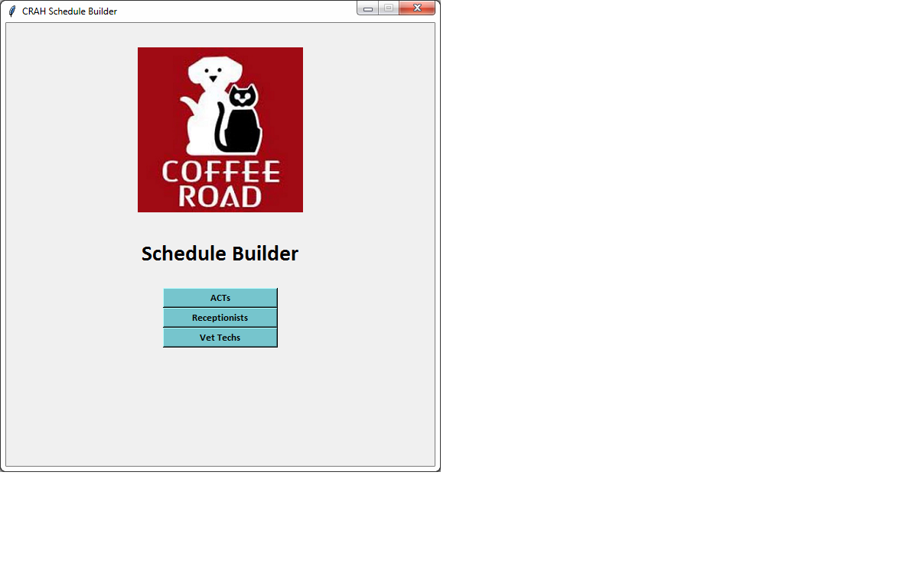
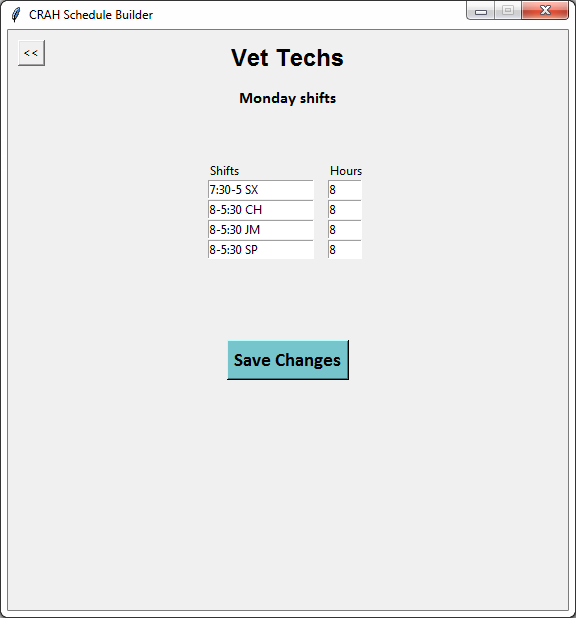
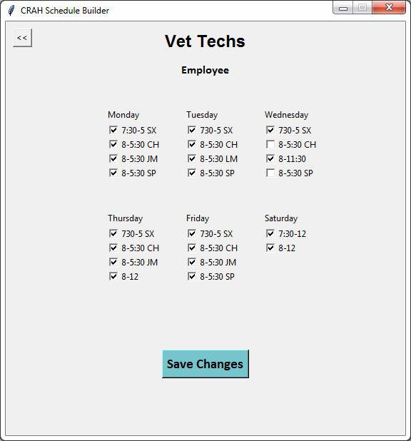
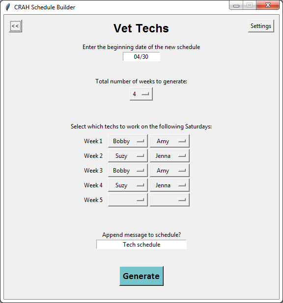
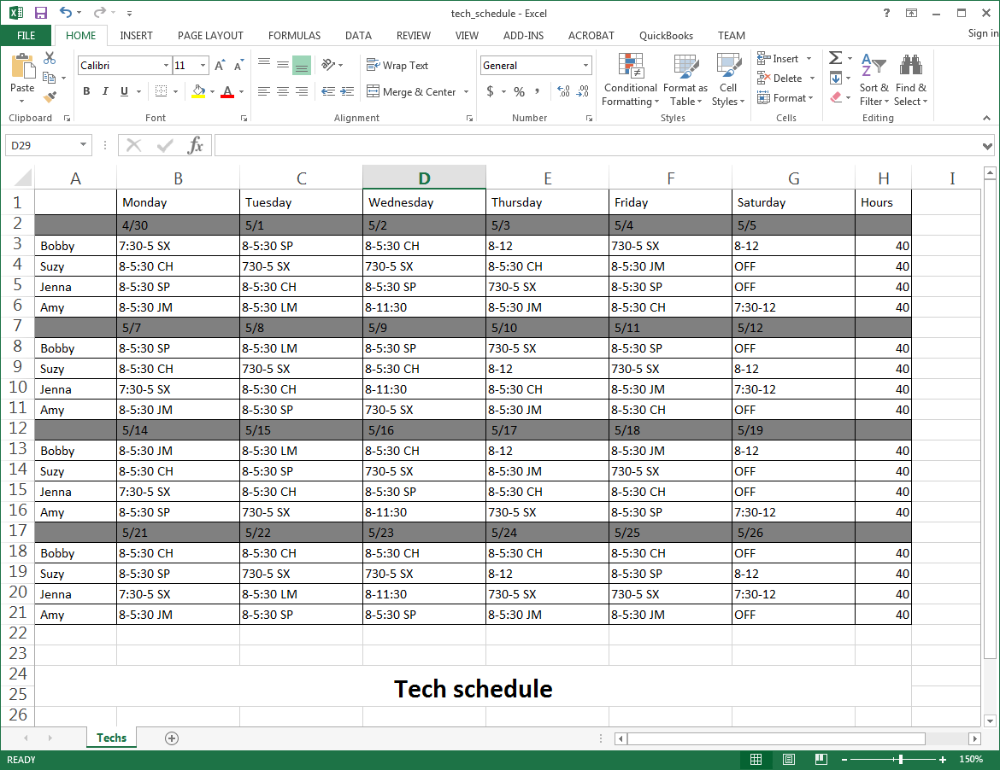

# CRAH Schedule Builder

This application automates most of the employee scheduling for all Coffee Road Animal Hospital staff areas.



## About

This application automates most of the employee scheduling for all Coffee Road Animal Hospital staff areas.

For several years, I did the employee scheduling for the Animal Care Taker staff area at CRAH. The process that went into creating the schedule was similar each month. Before learning to code, I thought to myself that there was likely a way to automate most of that process.

After learning to code, I decided to implement this idea into a program. Because I am familiar with scheduling needs for all staff areas, I created a program that can generate the schedule for each one. The program is currently used by CRAH and has been since March 2018.

## Getting Started

The code for this application can be downloaded using the following command:

```
git clone https://github.com/kyleoverstreet/crah-scheduler
```

See deployment for notes on how to deploy the project on a live system.

## Prerequisites

Python must be installed to run the application.

## Deployment

This application can be run by executing gui.py in the project directory

## How to Use

Each staff area has a separate interface which can be accessed from the main menu. Within each staff area, a settings page can be accessed. In the settings, the user can edit the shifts to be assigned in that staff area for any days of the week.



Also in the settings is the option to set preferences for specific employees, such as which days/shifts that employee can, or cannot, work (in progress).



Once the settings have been properly configured, the schedule can be generated by entering a small amount of information:
* The beginning date of the schedule
* Total number of weeks to generate
* Which employees to work on the weekend shifts (since the weekday shifts are dependent on this)



The generated schedules is output to an Excel worksheet. The formatting of the worksheet was designed to look nearly identical to the manually created schedules that the employees are used to seeing.

Here is the generated veterinary technician schedule:


## Built With

* [Python](https://www.python.org/) - Programming language
* [TkInter](https://wiki.python.org/moin/TkInter) - Python's standard GUI package
