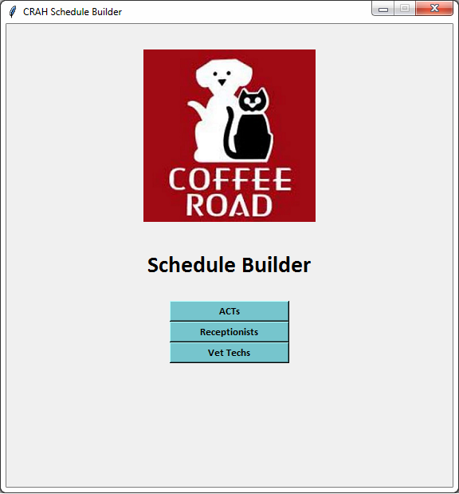

# CRAH Schedule Builder

This application automates most of the employee scheduling for all Coffee Road Animal Hospital staff areas.



## Getting Started

The code for this application can be downloaded using the following command:

```
git clone https://github.com/kyleoverstreet/crah-scheduler
```

See deployment for notes on how to deploy the project on a live system.

## Prerequisites

Python must be installed to run the application.

## Deployment

This application can be run by executing gui.py in the project directory

## Output

The generated schedules are output to an Excel worksheet. The formatting of the worksheet was designed to look nearly identical to the manually created schedules that the employees are used to seeing.

Here is an example of a generated veterinary technician schedule:


## Built With

* [Python](https://www.python.org/) - Programming language
* [TkInter](https://wiki.python.org/moin/TkInter) - Python's standard GUI package
